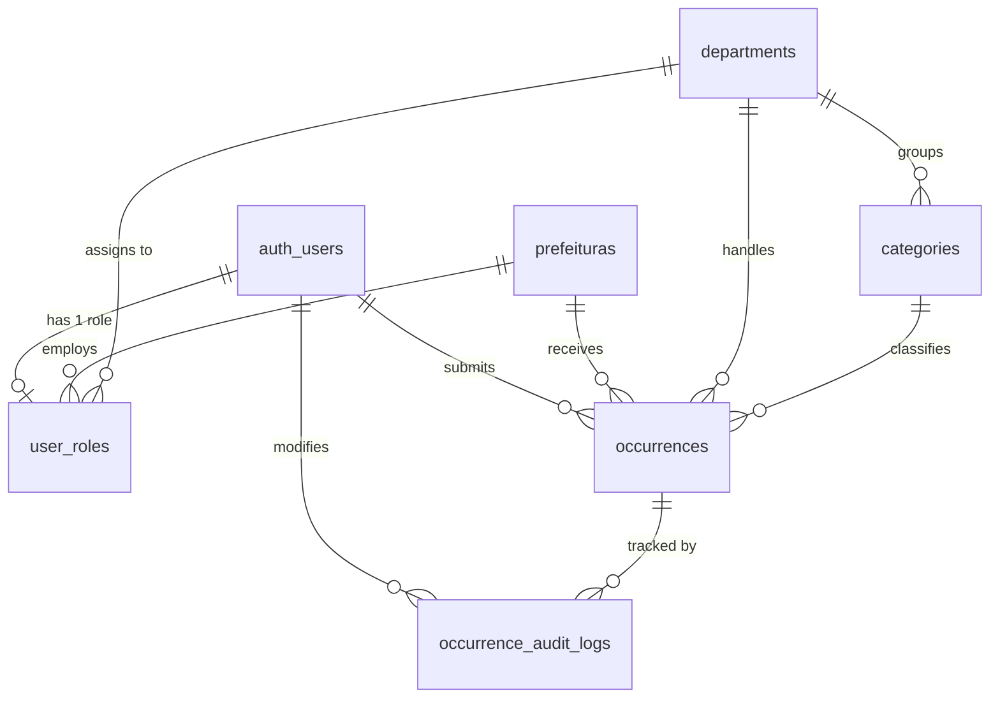

# Master Technical Blueprint — Conecta v3 (Cidadão Conecta)

> **Document Status:** MASTER — v1.0 (Definitive)
> **Authored by:** Senior Software Architect
> **Date:** 2026-05-30
> **Audience:** All engineering teams (Backend/Database, Mobile/Flutter, DevOps)

---

> [!IMPORTANT]
> This document is the single source of truth for the Conecta v3 rebuild. All previous architecture documents are preserved as historical records but must **not** be used as active implementation references. Any conflict between prior documents and this file must be resolved in favor of this document.

---

## Table of Contents

1. [Product Vision & Business Context](#1-product-vision--business-context)
2. [Platform Segmentation & Team Ownership](#2-platform-segmentation--team-ownership)
3. [Architecture Philosophy: Why Clean Architecture + Riverpod](#3-architecture-philosophy-why-clean-architecture--riverpod)
4. [Flutter Project Structure (Canonical Folder Layout)](#4-flutter-project-structure-canonical-folder-layout)
5. [Technology Stack & Dependency Manifest](#5-technology-stack--dependency-manifest)
6. [Design System & Visual Identity](#6-design-system--visual-identity)
7. [Backend Architecture: Supabase (PostgreSQL + Auth + Storage)](#7-backend-architecture-supabase-postgresql--auth--storage)
8. [Routing Architecture (GoRouter)](#8-routing-architecture-gorouter)
9. [Dependency Injection & Provider Graph (Riverpod)](#9-dependency-injection--provider-graph-riverpod)
10. [Domain Layer: Entities & Repository Contracts](#10-domain-layer-entities--repository-contracts)
11. [Data Layer: Services & Repository Implementations](#11-data-layer-services--repository-implementations)
12. [Feature Modules: Detailed Logical Flows](#12-feature-modules-detailed-logical-flows)
    - 12.1 [Authentication Module](#121-authentication-module)
    - 12.2 [Tenant Selection Module](#122-tenant-selection-module)
    - 12.3 [Home / Landing Module (Citizen)](#123-home--landing-module-citizen)
    - 12.4 [Camera Feature](#124-camera-feature-critical)
    - 12.5 [Request Submission Flow (Multi-Step)](#125-request-submission-flow-multi-step)
    - 12.6 [My Requests & Request Details Module](#126-my-requests--request-details-module)
    - 12.7 [Admin / Public Servant Module](#127-admin--public-servant-module)
13. [Visual References (Validated Mockups)](#13-visual-references-validated-mockups)
14. [Environment Setup & Onboarding Checklist](#14-environment-setup--onboarding-checklist)
15. [Critical Development Rules & Anti-Patterns](#15-critical-development-rules--anti-patterns)

---

## 1. Product Vision & Business Context

**Conecta v3** (marketed as **Cidadão Conecta**) is a full-stack digital urban stewardship (zeladoria urbana) platform. Its core mission is to digitize and streamline the public grievance (ouvidoria) process between citizens and their municipal governments (Prefeituras).

### System Modules

| Module | Actor | Primary Actions |
|---|---|---|
| **Citizen Space (Mobile App)** | Citizen (`USER`) | Open occurrence reports with geo-tagged photo evidence; track resolution via a visual timeline. |
| **Management Portal (Web)** | Public Servant (`ATTENDANT`, `MANAGER`, `CITY_ADMIN`) | Triage, filter, update, and annotate occurrence reports from their municipality. |
| **Administration** | City Admin / System Admin | Manage departments, categories, user access levels, and RBAC roles. |

### Multi-Tenancy Model

The system operates as a **multi-tenant SaaS** platform. A single Supabase instance serves multiple municipalities (`Prefeituras`). Tenant isolation is enforced at the database level through **Row Level Security (RLS)** policies that scope all data queries to the user's `prefeitura_id`. A System Admin (`SYSTEM_ADMIN`) is the only role capable of cross-tenant data access.

---

## 2. Platform Segmentation & Team Ownership

> [!IMPORTANT]
> The two platforms are **physically separate applications** (separate binaries/deployments) consuming a shared Supabase backend. Their codebases must **never** be merged into a single Flutter binary. Mixing the Citizen App and the Web Management Portal into one binary will create insurmountable routing, RBAC, and UX complexity.

| Platform | Technology | Target Audience | Target Device |
|---|---|---|---|
| **Cidadão Conecta** (Mobile App) | Flutter (Android & iOS) | Citizens | Smartphones |
| **Gestão Conecta** (Web Portal) | Next.js (React) | Public Servants & City Admins | Desktop Browsers |

Both platforms authenticate against the same **Supabase Auth** instance and read/write from the same **PostgreSQL** database, with RLS ensuring complete data isolation between tenants and user roles.

---

## 3. Architecture Philosophy: Why Clean Architecture + Riverpod

### Architectural Pattern: Clean Architecture

The mobile application adopts **Clean Architecture**, as defined by Robert C. Martin. The primary driver for this choice is the **Dependency Rule**: source code dependencies point exclusively inward, toward the Domain layer. This ensures the core business logic (entities, use cases) is completely agnostic of the UI framework, the database SDK, and any external packages.

This provides:
- **Testability:** Domain logic can be unit-tested without spinning up Flutter widgets or a live Supabase connection.
- **Replaceability:** The Supabase SDK can be replaced with a different BaaS (e.g., Firebase) by only modifying the Data layer, leaving Domain and Presentation completely untouched.
- **Scalability:** Features are self-contained and can be developed in parallel by different developers without merge conflicts.

### State Management: Flutter Riverpod

**Riverpod** (`flutter_riverpod: ^3.3.1`) was chosen as the state management and dependency injection solution for the following reasons:

1. **Compile-time Safety:** Unlike `Provider`, Riverpod providers are defined globally and are validated at compile time, eliminating the runtime `ProviderNotFoundException`.
2. **Decoupled DI:** The dependency graph (services → repositories → controllers) is wired declaratively via `Provider` definitions, removing the need for `BuildContext` to access dependencies.
3. **Async-First:** `FutureProvider` and `AsyncNotifier` provide first-class, ergonomic handling of asynchronous state, replacing verbose `FutureBuilder`/`StreamBuilder` patterns at the controller level.
4. **Strict Prohibition:** Usage of `GetX`, `Provider` package, `setState` in business logic, or `BLoC` is **explicitly prohibited** in this project.

### Pattern: Notifier vs AsyncNotifier

- Use `Notifier<T>` for synchronous state that may be mutated by discrete user actions (e.g., `RequestDraftController` accumulating form field data step by step).
- Use `AsyncNotifier<T>` for state that is loaded from an async source upon initialization (e.g., `MyRequestsController` fetching the user's request list from Supabase).

---

## 4. Flutter Project Structure (Canonical Folder Layout)

The project root is `cidadao_conecta/`. All application source code resides in `lib/`.

```
cidadao_conecta/
├── .env                        # Secret keys (SUPABASE_URL, SUPABASE_ANON_KEY) — NOT committed to git
├── .env.example                # Template for .env — MUST be committed to git
├── pubspec.yaml                # Dependency manifest
├── analysis_options.yaml       # Lint rules (flutter_lints)
└── lib/
    ├── main.dart               # App entry point: loads .env, inits Supabase, wraps in ProviderScope
    ├── config/
    │   └── app_config.dart     # AppConfig.loadEnv() — reads flutter_dotenv
    ├── core/
    │   ├── network/
    │   │   └── supabase_client.dart  # SupabaseConfig.initialize() & .client singleton
    │   └── di/
    │       └── providers.dart        # ALL Riverpod Provider definitions (global DI graph)
    ├── domain/
    │   ├── models/
    │   │   ├── app_user.dart         # AppUser entity (id, email, name, isAdmin)
    │   │   ├── prefeitura_model.dart # Prefeitura entity (id, name, primaryColor, secondaryColor, logoUrl)
    │   │   └── user_role_model.dart  # UserRole entity (userId, role, prefeituraId, accessLevel)
    │   └── repositories/
    │       ├── auth_repository.dart      # Abstract: authStateChanges, signIn, signUp, signOut
    │       ├── tenant_repository.dart    # Abstract: fetchAllTenants(), fetchTenantById()
    │       └── requests_repository.dart  # Abstract: CRUD for occurrences, notes, categories
    ├── data/
    │   ├── services/
    │   │   ├── supabase_auth_service.dart    # Direct Supabase Auth SDK calls
    │   │   ├── supabase_tenant_service.dart  # Queries public.prefeituras table
    │   │   └── supabase_storage_service.dart # Uploads files to Supabase Storage bucket
    │   └── repositories/
    │       ├── auth_repository_impl.dart     # Implements AuthRepository using SupabaseAuthService
    │       ├── tenant_repository_impl.dart   # Implements TenantRepository
    │       └── requests_repository_impl.dart # Implements RequestsRepository (full CRUD + storage upload)
    ├── routing/
    │   ├── app_router.dart      # GoRouter configuration with auth redirect guard
    │   ├── route_names.dart     # RouteNames constants class
    │   └── router_notifier.dart # ChangeNotifier that triggers GoRouter refresh on auth state change
    └── ui/
        ├── core/
        │   ├── themes/
        │   │   ├── app_colors.dart    # AppColors — static color constants
        │   │   └── tenant_theme.dart  # TenantTheme class with ThemeData factory
        │   └── components/
        │       ├── primary_button.dart    # Reusable CTA button (loading state aware)
        │       ├── custom_text_field.dart # Styled text input component
        │       ├── action_card.dart       # Home screen action shortcut card
        │       └── bottom_nav_bar.dart    # Shared bottom navigation bar
        └── features/
            ├── auth/
            │   ├── auth_controller.dart       # Auth Notifier (sign in, sign up logic)
            │   ├── screens/
            │   │   ├── login_screen.dart
            │   │   ├── register_screen.dart
            │   │   ├── recovery_screen.dart
            │   │   └── select_tenant_screen.dart
            │   └── widgets/
            ├── home/
            │   └── screens/
            │       └── home_screen.dart       # Citizen landing page with action cards
            ├── requests/
            │   ├── models/
            │   │   ├── request_model.dart      # RequestModel entity + RequestStatus enum + fromJson/toJson
            │   │   ├── request_draft.dart      # RequestDraft — immutable state for multi-step form
            │   │   ├── category_model.dart     # CategoryModel (id, name)
            │   │   └── internal_note_model.dart
            │   ├── controllers/
            │   │   ├── request_draft_controller.dart  # NotifierProvider — manages multi-step form state + submission
            │   │   ├── my_requests_controller.dart    # AsyncNotifierProvider — loads citizen's own requests
            │   │   ├── categories_controller.dart     # FutureProvider — loads category list
            │   │   └── internal_notes_controller.dart # Loads notes for admin detail view
            │   └── screens/
            │       ├── camera_screen.dart          # CameraAwesome integration
            │       ├── select_category_screen.dart
            │       ├── request_form_screen.dart    # Title + Description + Photo + Map confirmation
            │       ├── my_requests_screen.dart
            │       ├── request_details_screen.dart # Timeline view (dual-mode: citizen / admin)
            │       └── request_success_screen.dart
```

---

## 5. Technology Stack & Dependency Manifest

The canonical `pubspec.yaml` dependencies for `cidadao_conecta`. All versions are **pinned** as shown. Do not upgrade major versions without explicit architectural review.

### Runtime Dependencies

```yaml
environment:
  sdk: ^3.11.5

dependencies:
  flutter:
    sdk: flutter

  # --- Core Infrastructure ---
  supabase_flutter: ^2.12.4     # BaaS: Auth, PostgREST queries, Realtime, Storage
  flutter_riverpod: ^3.3.1      # State management & DI
  go_router: ^17.2.3            # Declarative routing with deep-link support
  flutter_dotenv: ^6.0.1        # .env file loading for secret management
  shared_preferences: ^2.5.5   # Lightweight local persistence (last selected tenant ID)

  # --- Visual & Maps ---
  google_fonts: ^8.1.0          # Inter font family
  cupertino_icons: ^1.0.8       # iOS-style icon set
  flutter_map: ^8.3.0           # OpenStreetMap tile renderer
  latlong2: ^0.9.1              # Geographic coordinate math
  cached_network_image: ^3.4.1  # Async image loading with disk cache

  # --- Camera & Files ---
  camerawesome: ^2.5.0          # Full-featured camera UI/engine
  path_provider: ^2.1.5         # OS-specific directory access
  path: ^1.9.1                  # Path string manipulation
  uuid: ^4.5.3                  # RFC 4122 UUID generation (local file naming)
  intl: ^0.20.2                 # Date/time formatting for audit log displays

  # --- Geolocation ---
  geolocator: ^14.0.2           # GPS position acquisition with permission handling
```

### Development Dependencies

```yaml
dev_dependencies:
  flutter_test:
    sdk: flutter
  flutter_lints: ^6.0.0         # Enforced lint rules (analysis_options.yaml)
```

### Asset Registration

The `.env` file **must** be registered as a Flutter asset so `flutter_dotenv` can load it at runtime:

```yaml
flutter:
  uses-material-design: true
  assets:
    - .env
```

> [!WARNING]
> The `.env` file contains your `SUPABASE_URL` and `SUPABASE_ANON_KEY`. It **must** be listed in `.gitignore`. Commit `.env.example` with placeholder values instead. Never commit real keys to version control.

---

## 6. Design System & Visual Identity

The app uses a **"Clean UI"** aesthetic — deliberately avoiding the heavy shadows, saturated colors, and rigid visual hierarchy of default Material Design. The philosophy is: generous white space, precise typography, and purposeful color use.

### 6.1 Color Palette

All colors are defined in `lib/ui/core/themes/app_colors.dart` (static constants) and also used in `tenant_theme.dart`. The **primary and secondary colors are tenant-overridable**; all others are static brand constants.

| Role | Token | Hex | Usage |
|---|---|---|---|
| **Primary (Tenant)** | `primaryColor` | `#003B73` | AppBars, primary buttons, focused borders, title text, icons |
| **Secondary (Tenant)** | `secondaryColor` | `#005B9F` | Secondary actions, tonal surfaces |
| **Background (Scaffold)** | `AppColors.white` | `#FFFFFF` | Global scaffold background — enforces the clean aesthetic |
| **Surface (Cards)** | `AppColors.white` | `#FFFFFF` | Card backgrounds, input fill |
| **Internal Screen Background** | `AppColors.backgroundGrey` | `#F0F4F8` | Content area backgrounds on list screens |
| **Card Accent** | `AppColors.blueLight` | `#E8EEF4` | Subtle card backgrounds when differentiation is needed |
| **Border / Divider** | `AppColors.greyLight` | `#D9D9D9` | Input borders (enabled state), card borders, dividers |
| **Body Text (Primary)** | `AppColors.black` | `#000000` | `bodyLarge` text — main readable content |
| **Body Text (Secondary)** | `AppColors.greyDark` | `#555555` | `bodyMedium`, hint text, timestamps, metadata |
| **Error / Destructive** | `AppColors.error` | `#D32F2F` | Error snackbars, input validation errors, `errorBorder` |
| **Success** | `AppColors.success` | `#388E3C` | Status chips for "COMPLETED" occurrences |

### 6.2 Typography

- **Font Family:** `Inter` (loaded via `google_fonts: ^8.1.0`). No other typeface is permitted.
- The base text theme is constructed via `GoogleFonts.interTextTheme()` and then extended with `.copyWith(...)`.

| TextStyle Token | Color | Weight | Usage |
|---|---|---|---|
| `displayLarge` | `primaryColor` | `FontWeight.bold` | Large hero headings |
| `titleLarge` | `primaryColor` | `FontWeight.bold` | Screen titles, section headers |
| `bodyLarge` | `#000000` | Regular | Main body copy |
| `bodyMedium` | `#555555` | Regular | Supporting text, hints, metadata |

### 6.3 Input Field Standard

All `TextField` widgets across the application must conform to the global `InputDecorationTheme` defined in `TenantTheme.themeData`. Manual per-widget decoration that overrides these is forbidden.

| Property | Value |
|---|---|
| `fillColor` | `#FFFFFF` |
| `border` | `OutlineInputBorder`, `BorderRadius.circular(8)`, `Color(#D9D9D9)` |
| `enabledBorder` | Same as `border` |
| `focusedBorder` | `OutlineInputBorder`, `BorderRadius.circular(8)`, `primaryColor`, `width: 2` |
| `hintStyle` | `Inter`, `Color(#555555)` |

### 6.4 TenantTheme — Dynamic Theming Architecture

The design system supports **per-tenant branding overrides**. The `TenantTheme` class acts as a factory that generates the full `ThemeData` object. This enables different municipalities to present their own primary/secondary colors and logo without modifying any app code.

**`TenantTheme` factories:**
- `TenantTheme.defaultTheme()` — Returns the standard Conecta blue palette. Used before tenant selection or as a fallback.
- `TenantTheme.fromPrefeitura(prefeitura)` — Parses `primaryColor` (hex string) and `secondaryColor` from the `Prefeitura` model, falling back to the default palette if the value is null or unparseable.

The active theme is exposed to the widget tree via the `tenantThemeProvider` Riverpod provider. `MyApp` is a `ConsumerWidget` that reads this provider and applies `theme: tenantTheme.themeData` to `MaterialApp.router`.

### 6.5 Reusable Component Library

Located at `lib/ui/core/components/`. All shared interactive widgets must be sourced from this library. Creating ad-hoc copies of these components in feature folders is forbidden.

| File | Widget | Purpose |
|---|---|---|
| `primary_button.dart` | `PrimaryButton` | Main CTA button. Accepts `onPressed`, `label`, `isLoading` (shows `CircularProgressIndicator` when true). |
| `custom_text_field.dart` | `CustomTextField` | Standard text input. Wraps `TextField` with the global `InputDecoration`. |
| `action_card.dart` | `ActionCard` | Home screen shortcut tile. Icon + label + `onTap` callback. |
| `bottom_nav_bar.dart` | `BottomNavBar` | Shared bottom navigation for the citizen home module. |

---

## 7. Backend Architecture: Supabase (PostgreSQL + Auth + Storage)

### 7.1 Entity Relationship Diagram (ERD)



### 7.2 Complete Data Dictionary (Schema: `public`)

All primary keys are `UUID` generated by `gen_random_uuid()`. All timestamps use `TIMESTAMP WITH TIME ZONE DEFAULT timezone('utc', now())`.

#### Table: `prefeituras`
Stores the SaaS tenants (municipalities).
| Column | Type | Constraints | Description |
|---|---|---|---|
| `id` | UUID | PK, DEFAULT `gen_random_uuid()` | Tenant identifier |
| `name` | TEXT | NOT NULL, UNIQUE | Full municipality name |
| `created_at` | TIMESTAMPTZ | NOT NULL, DEFAULT now() | Record creation time |

> **Future Extension:** Add `primary_color` (TEXT), `secondary_color` (TEXT), and `logo_url` (TEXT) columns to enable per-tenant theming from the database.

#### Table: `departments`
Internal secretariats/departments within a municipality.
| Column | Type | Constraints | Description |
|---|---|---|---|
| `id` | UUID | PK | Department identifier |
| `name` | TEXT | NOT NULL, UNIQUE | e.g., "Secretaria de Obras", "Iluminação Pública" |
| `created_at` | TIMESTAMPTZ | NOT NULL | — |

#### Table: `categories`
Problem sub-types, each belonging to one department.
| Column | Type | Constraints | Description |
|---|---|---|---|
| `id` | UUID | PK | Category identifier |
| `name` | TEXT | NOT NULL, UNIQUE | e.g., "Buraco na Via", "Poste Apagado" |
| `department_id` | UUID | FK → `departments.id` ON DELETE CASCADE | Parent department |
| `created_at` | TIMESTAMPTZ | NOT NULL | — |

#### Table: `user_roles`
Role-Based Access Control table. Populated automatically via the `on_auth_user_created` trigger.
| Column | Type | Constraints | Description |
|---|---|---|---|
| `user_id` | UUID | PK, FK → `auth.users.id` ON DELETE CASCADE | Links to Supabase Auth |
| `role` | TEXT | NOT NULL, CHECK IN (`USER`, `ATTENDANT`, `MANAGER`, `AUDITOR`, `CITY_ADMIN`, `SYSTEM_ADMIN`) | User's authorization role |
| `department_id` | UUID | FK → `departments.id` ON DELETE SET NULL, NULLABLE | Assigned department (null for citizens) |
| `prefeitura_id` | UUID | FK → `prefeituras.id` ON DELETE SET NULL | Tenant association |
| `access_level` | INT | NOT NULL, DEFAULT 0, CHECK (0–5) | Numeric permission level for portal page gating |
| `created_at` | TIMESTAMPTZ | NOT NULL | — |

**Role to Access Level Mapping:**

| Role | `access_level` | Capabilities |
|---|---|---|
| `USER` | 0 | Open and view own occurrences only |
| `ATTENDANT` | 1 | View & update occurrences in their tenant |
| `MANAGER` | 2 | All ATTENDANT capabilities + audit log access |
| `AUDITOR` | 3 | Read-only access to all tenant data + analytics |
| `CITY_ADMIN` | 4 | Full tenant management + user administration |
| `SYSTEM_ADMIN` | 5 | Cross-tenant access; hard deletes; full system control |

#### Table: `occurrences`
The core domain table. Stores all citizen-submitted reports.
| Column | Type | Constraints | Description |
|---|---|---|---|
| `id` | UUID | PK | Occurrence identifier |
| `title` | TEXT | NOT NULL | Short problem title |
| `description` | TEXT | NOT NULL | Detailed citizen narrative |
| `latitude` | DOUBLE PRECISION | NULLABLE | GPS Y-coordinate |
| `longitude` | DOUBLE PRECISION | NULLABLE | GPS X-coordinate |
| `image_url` | TEXT | NULLABLE | Public URL from Supabase Storage |
| `status` | `occurrence_status` ENUM | NOT NULL, DEFAULT `PENDING` | Lifecycle state |
| `user_id` | UUID | FK → `auth.users.id` ON DELETE CASCADE | Reporting citizen |
| `category_id` | UUID | FK → `categories.id` ON DELETE SET NULL | Problem classification |
| `department_id` | UUID | FK → `departments.id` ON DELETE SET NULL | Responsible department |
| `prefeitura_id` | UUID | FK → `prefeituras.id` ON DELETE CASCADE, NOT NULL | Tenant scope key for RLS |
| `created_at` | TIMESTAMPTZ | NOT NULL | — |

**`occurrence_status` ENUM values:**
```sql
CREATE TYPE public.occurrence_status AS ENUM ('PENDING', 'ANALYZING', 'IN_PROGRESS', 'COMPLETED');
```

**Performance Indexes:**
```sql
CREATE INDEX idx_occurrences_prefeitura ON public.occurrences(prefeitura_id);
CREATE INDEX idx_occurrences_status     ON public.occurrences(status);
CREATE INDEX idx_occurrences_department ON public.occurrences(department_id);
```

#### Table: `occurrence_audit_logs`
Immutable, append-only audit trail. No `UPDATE` or `DELETE` policies exist for this table.
| Column | Type | Constraints | Description |
|---|---|---|---|
| `id` | UUID | PK | Log entry identifier |
| `occurrence_id` | UUID | FK → `occurrences.id` ON DELETE CASCADE | Parent occurrence |
| `altered_by` | UUID | FK → `auth.users.id`, NOT NULL | Public servant who made the change |
| `old_category` | TEXT | NOT NULL | Category before change |
| `new_category` | TEXT | NOT NULL | Category after change |
| `old_department` | TEXT | NOT NULL | Department before change |
| `new_department` | TEXT | NOT NULL | Department after change |
| `reason` | TEXT | NOT NULL | Internal note / justification |
| `protocol_number` | TEXT | NOT NULL, UNIQUE | Auto-generated via Trigger (e.g., `ALT-2026-000001`) |
| `created_at` | TIMESTAMPTZ | NOT NULL | — |

#### Table: `portal_pages`
Drives dynamic route-level authorization in the Web Management Portal. Each route in the portal is registered here with a `required_level`. RLS on this table prevents users from querying routes they do not have access to.
| Column | Type | Constraints | Description |
|---|---|---|---|
| `id` | UUID | PK | Page record identifier |
| `name` | TEXT | NOT NULL, UNIQUE | Descriptive name (e.g., "User Management") |
| `path` | TEXT | NOT NULL, UNIQUE | Web route path (e.g., `/admin/users`) |
| `required_level` | INT | NOT NULL, CHECK (1–5) | Minimum `access_level` required |
| `created_at` | TIMESTAMPTZ | NOT NULL | — |

### 7.3 Database Triggers

#### Trigger 1: `on_auth_user_created` — Automatic Profile Creation

Fires `AFTER INSERT ON auth.users`. Every time Supabase Auth creates a user (from the app's sign-up flow), this trigger automatically inserts a corresponding record into `public.user_roles`, reading the `role` and `prefeitura_id` values from the registration metadata (`raw_user_meta_data`).

```sql
CREATE OR REPLACE FUNCTION public.handle_new_user()
RETURNS trigger AS $$
BEGIN
    INSERT INTO public.user_roles (user_id, role, prefeitura_id, access_level)
    VALUES (
        new.id,
        COALESCE(new.raw_user_meta_data ->> 'role', 'USER'),
        (new.raw_user_meta_data ->> 'prefeitura_id')::uuid,
        COALESCE((new.raw_user_meta_data ->> 'access_level')::int, 0)
    );
    RETURN NEW;
END;
$$ LANGUAGE plpgsql SECURITY DEFINER SET search_path = public;

CREATE OR REPLACE TRIGGER on_auth_user_created
    AFTER INSERT ON auth.users
    FOR EACH ROW EXECUTE FUNCTION public.handle_new_user();
```

> [!IMPORTANT]
> The mobile app's sign-up call must pass `prefeitura_id` in the `data` (metadata) map of `supabase.auth.signUp(...)`. Without this, the trigger will insert a null `prefeitura_id` and the user will be invisible to all tenant-scoped RLS policies.

#### Trigger 2: `tg_generate_audit_protocol` — Protocol Number Generation

Fires `BEFORE INSERT ON public.occurrence_audit_logs`. Uses a PostgreSQL `SEQUENCE` to generate a human-readable, zero-padded, year-prefixed protocol number.

```sql
CREATE SEQUENCE public.occurrence_audit_protocol_seq START WITH 1;

CREATE OR REPLACE FUNCTION public.tg_fn_generate_audit_protocol()
RETURNS TRIGGER AS $$
DECLARE
    next_val INT;
    year_prefix TEXT;
BEGIN
    next_val := nextval('public.occurrence_audit_protocol_seq');
    year_prefix := to_char(now(), 'YYYY');
    NEW.protocol_number := 'ALT-' || year_prefix || '-' || lpad(next_val::text, 6, '0');
    RETURN NEW;
END;
$$ LANGUAGE plpgsql;

CREATE TRIGGER tg_generate_audit_protocol
BEFORE INSERT ON public.occurrence_audit_logs
FOR EACH ROW EXECUTE FUNCTION public.tg_fn_generate_audit_protocol();
```

**Example output:** `ALT-2026-000001`, `ALT-2026-000042`

### 7.4 Row Level Security (RLS) Architecture

RLS is **enabled on all tables** in the `public` schema. No exceptions.

#### Anti-Recursion Helper Functions (`SECURITY DEFINER`)

A naive RLS policy on `user_roles` would trigger infinite recursion (PostgreSQL error `42P17`). To solve this, four `SECURITY DEFINER` functions are defined. These execute with superuser privileges, bypassing RLS, and are safe to use inside policies on other tables.

```sql
CREATE OR REPLACE FUNCTION public.get_current_user_role()
RETURNS TEXT AS $$
    SELECT role FROM public.user_roles WHERE user_id = auth.uid() LIMIT 1;
$$ LANGUAGE sql SECURITY DEFINER SET search_path = public;

CREATE OR REPLACE FUNCTION public.get_current_user_access_level()
RETURNS INT AS $$
    SELECT access_level FROM public.user_roles WHERE user_id = auth.uid() LIMIT 1;
$$ LANGUAGE sql SECURITY DEFINER SET search_path = public;

CREATE OR REPLACE FUNCTION public.get_current_user_department_id()
RETURNS UUID AS $$
    SELECT department_id FROM public.user_roles WHERE user_id = auth.uid() LIMIT 1;
$$ LANGUAGE sql SECURITY DEFINER SET search_path = public;

CREATE OR REPLACE FUNCTION public.get_current_user_prefeitura_id()
RETURNS UUID AS $$
    SELECT prefeitura_id FROM public.user_roles WHERE user_id = auth.uid() LIMIT 1;
$$ LANGUAGE sql SECURITY DEFINER SET search_path = public;
```

#### RLS Policy Summary

| Table | Operation | Policy Rule (Summary) |
|---|---|---|
| `prefeituras` | SELECT | All authenticated users (public tenant list for selection screen) |
| `departments` | SELECT | All authenticated users |
| `categories` | SELECT | All authenticated users |
| `user_roles` | SELECT | Own record, OR AUDITOR/CITY_ADMIN/SYSTEM_ADMIN |
| `occurrences` | SELECT | SYSTEM_ADMIN (all) OR own `prefeitura_id` |
| `occurrences` | INSERT | SYSTEM_ADMIN (all) OR own `prefeitura_id` |
| `occurrences` | UPDATE | SYSTEM_ADMIN OR (own `prefeitura_id` AND `access_level >= 1` OR own record) |
| `occurrences` | DELETE | SYSTEM_ADMIN OR (own `prefeitura_id` AND `access_level >= 4`) |
| `occurrence_audit_logs` | SELECT | AUDITOR/CITY_ADMIN/SYSTEM_ADMIN OR servants in the same department as the occurrence |
| `occurrence_audit_logs` | INSERT | ATTENDANT/MANAGER/CITY_ADMIN/SYSTEM_ADMIN only |
| `occurrence_audit_logs` | UPDATE | **No policy — inherently immutable** |
| `occurrence_audit_logs` | DELETE | **No policy — inherently immutable** |
| `portal_pages` | SELECT | `access_level >= required_level` |
| `portal_pages` | ALL | `access_level >= 4` (CITY_ADMIN and above) |

### 7.5 Supabase Storage

- **Bucket name:** `occurrences_media`
- **File path pattern:** `{userId}/{timestamp}_{userId}.{ext}`
- **Access:** The bucket must be configured with a public read policy so uploaded images can be rendered via their public URL in both the mobile app and the web portal.
- **Upload is performed by:** `SupabaseStorageService.uploadImage()`, called from `RequestsRepositoryImpl.createRequest()` immediately before inserting the occurrence record.

---

## 8. Routing Architecture (GoRouter)

### 8.1 Authentication Guard (Redirect Logic)

GoRouter is configured with a global `redirect` callback that enforces authentication. `RouterNotifier` (a `ChangeNotifier`) is passed as `refreshListenable`, ensuring GoRouter re-evaluates the redirect every time the auth state changes (login/logout events from `authStateProvider`).

**Redirect Rules:**
1. If auth state is loading or has an error → `return null` (do nothing, wait).
2. If user is **not authenticated** and is navigating to a **non-auth route** → redirect to `/login`.
3. If user **is authenticated** and is navigating to an **auth route** (login, register, etc.) → redirect to `/` (home).

### 8.2 Complete Route Map (Mobile App)

| Path | Screen | Notes |
|---|---|---|
| `/` | `HomeScreen` | Named: `RouteNames.home`. Default authenticated destination. |
| `/login` | `LoginScreen` | Named: `RouteNames.login`. |
| `/register` | `RegisterScreen` | Named: `RouteNames.register`. |
| `/recovery` | `RecoveryScreen` | Named: `RouteNames.recovery`. Password reset flow. |
| `/select-tenant` | `SelectTenantScreen` | Displayed post-registration or when no tenant is cached. |
| `/open-request/categories` | `SelectCategoryScreen` | Step 1 of new request flow. |
| `/open-request/form` | `RequestFormScreen` | Step 2: title, description, photo (camera), location (map). |
| `/open-request/camera` | `CameraScreen` | Launched from `RequestFormScreen`. Returns photo path via `context.pop(path)`. |
| `/open-request/success` | `RequestSuccessScreen` | Receives `protocol` via `state.extra as String`. |
| `/my-requests` | `MyRequestsScreen` | Citizen's own request list. |
| `/request-details` | `RequestDetailsScreen` | Receives `RequestModel` via `state.extra`. Read-only citizen view with visual timeline. |

> [!NOTE]
> The mobile `RequestDetailsScreen` is a **citizen-only, read-only** screen. It displays the occurrence details and a visual public timeline. All administrative actions (status updates, internal notes, triage) are performed exclusively through the **Gestão Conecta** web portal (Next.js).

### 8.3 Web Portal Route Map

The web portal is a separate application. The following routes are defined as canonical:

| Path | Screen | Minimum Role |
|---|---|---|
| `/login` | Admin Login Screen | — |
| `/dashboard` | Analytics Dashboard (occurrences open vs closed) | `ATTENDANT` |
| `/requests` | Occurrence Triage Grid with filters | `ATTENDANT` |
| `/requests/:id` | Occurrence Detail (Slide-over panel / Modal) | `ATTENDANT` |
| `/departments` | Department & Category Management | `CITY_ADMIN` |
| `/users` | User Administration (Invite, set role/level) | `CITY_ADMIN` |
| `/settings` | General Municipality Settings | `CITY_ADMIN` |

Route availability in the portal should be driven by the `portal_pages` table + RLS, so that users only receive navigation items appropriate to their `access_level`.

---

## 9. Dependency Injection & Provider Graph (Riverpod)

All providers are defined in `lib/core/di/providers.dart`. The dependency graph flows strictly from infrastructure outward, following the dependency inversion principle.

```
SupabaseConfig.client (singleton)
    │
    └─► supabaseClientProvider (Provider<SupabaseClient>)
            │
            ├─► tenantServiceProvider (Provider<SupabaseTenantService>)
            │       └─► tenantRepositoryProvider (Provider<TenantRepository>)
            │               ├─► allTenantsProvider (FutureProvider<List<Prefeitura>>)
            │               └─► currentTenantProvider (FutureProvider<Prefeitura?>)
            │                       └─► tenantThemeProvider (Provider<TenantTheme>)
            │
            ├─► authServiceProvider (Provider<SupabaseAuthService>)
            │       └─► authRepositoryProvider (Provider<AuthRepository>)
            │               └─► authStateProvider (StreamProvider<AppUser?>)
            │
            ├─► storageServiceProvider (Provider<SupabaseStorageService>)
            │
            └─► requestsRepositoryProvider (Provider<RequestsRepository>)
                    └─► [exposes methods used by feature-level controllers]

Feature-level providers (in controller files):
    ├─► requestDraftProvider (NotifierProvider<RequestDraftController, RequestDraft>)
    ├─► myRequestsProvider (AsyncNotifierProvider<MyRequestsController, List<RequestModel>>)
    ├─► categoriesController (FutureProvider-like)
    └─► internalNotesController
```

**`currentTenantProvider`** — This provider reads `SharedPreferences` for the key `last_prefeitura_id` to restore the previously selected tenant between sessions. It only executes if the user is authenticated (guards on `authStateProvider`).

**`tenantThemeProvider`** — Watches `currentTenantProvider` and uses `.maybeWhen(data: ..., orElse: ...)` to safely handle the loading and error states, always falling back to `TenantTheme.defaultTheme()`.

---

## 10. Domain Layer: Entities & Repository Contracts

The Domain layer contains only Dart classes with zero external package dependencies. It is the innermost, most stable layer of the architecture.

### 10.1 Entities

#### `AppUser`
Represents the authenticated application user, abstracting the Supabase `User` object.
```dart
class AppUser {
  final String id;
  final String email;
  final String? name;
  final bool isAdmin;
  // factory AppUser.empty()
  // Implements == and hashCode
}
```

#### `Prefeitura`
Represents a municipality (tenant). Includes optional branding fields for theme override.
```dart
class Prefeitura {
  final String id;
  final String name;
  final String? primaryColor;   // Hex string, e.g., "#003B73"
  final String? secondaryColor; // Hex string
  final String? logoUrl;
}
```

#### `UserRole`
Represents the RBAC record associated with a user.
```dart
class UserRole {
  final String userId;
  final String role;
  final String? prefeituraId;
  final String? departmentId;
  final int accessLevel;
}
```

#### `RequestModel`

> [!NOTE]
> `RequestModel` lives in the `ui/features/requests/models/` folder (a pragmatic decision in the current codebase) but is logically a Domain entity. During a full rewrite, it should be moved to `lib/domain/models/`.

```dart
enum RequestStatus { pending, inProgress, resolved }
// fromString(String dbValue) — maps DB ENUM to Dart enum
// toDbString() — maps Dart enum to DB ENUM string

class RequestModel {
  final String id;
  final String userId;
  final String title;
  final String description;
  final String category;      // Denormalized category name for display
  final String? categoryId;
  final double latitude;
  final double longitude;
  final String? imageUrl;
  final RequestStatus status;
  final DateTime createdAt;
  final String? prefeituraId;

  // Computed properties:
  String get protocol => id.split('-').first.toUpperCase();
  String get address => 'Lat: ${latitude.toStringAsFixed(4)}, Lng: ${longitude.toStringAsFixed(4)}';

  factory RequestModel.fromJson(Map<String, dynamic> json)
  Map<String, dynamic> toJson()
}
```

**Status Mapping (`fromString`):**

| DB ENUM String | Dart `RequestStatus` | `displayName` |
|---|---|---|
| `PENDING` | `pending` | `"Em Análise"` |
| `IN_PROGRESS` | `inProgress` | `"Em Andamento"` |
| `COMPLETED` or `RESOLVED` | `resolved` | `"Concluído"` |

#### `RequestDraft`
Immutable state object used by `RequestDraftController` to accumulate data across the multi-step request submission form. Uses the `copyWith` pattern.
```dart
class RequestDraft {
  final String? categoryId;
  final String? categoryName;
  final String? address;
  final String? description;
  final String? photoPath;  // Local file system path to the captured photo
  final String? title;
  final double? latitude;
  final double? longitude;
  // copyWith(...)
}
```

### 10.2 Repository Contracts (Abstract Interfaces)

#### `AuthRepository`
```dart
abstract class AuthRepository {
  Stream<AppUser?> get authStateChanges;
  Future<void> signIn(String email, String password);
  Future<void> signUp(String email, String password, {String? name, String? prefeituraId});
  Future<void> signOut();
  Future<void> resetPassword(String email);
}
```

#### `TenantRepository`
```dart
abstract class TenantRepository {
  Future<List<Prefeitura>> fetchAllTenants();
  Future<Prefeitura?> fetchTenantById(String id);
}
```

#### `RequestsRepository`
```dart
abstract class RequestsRepository {
  Future<List<CategoryModel>> getCategories();
  Future<RequestModel> createRequest(RequestModel request, {String? localImagePath});
  Future<List<RequestModel>> getUserRequests(String userId);
  Future<List<RequestModel>> getTenantRequests(String prefeituraId);
  Future<void> updateRequestStatus(String requestId, RequestStatus newStatus);
  Future<List<InternalNoteModel>> getInternalNotes(String requestId);
  Future<void> addInternalNote(String requestId, String adminId, String content);
}
```

---

## 11. Data Layer: Services & Repository Implementations

### 11.1 `SupabaseAuthService`

Thin wrapper around the `supabase_flutter` Auth SDK. Exposes `signIn`, `signUp`, `signOut`, `resetPassword`, `authStateChanges` (Stream), and `currentUser`.

**Critical Implementation Note — Sign-Up Metadata:**
When calling `_client.auth.signUp()`, the `data` map must include `prefeitura_id`. This ensures the `on_auth_user_created` trigger correctly populates `user_roles` with the citizen's tenant:

```dart
Future<AuthResponse> signUp(String email, String password, {
  String? name,
  String? prefeituraId,
}) async {
  return await _client.auth.signUp(
    email: email,
    password: password,
    data: {
      if (name != null) 'name': name,
      if (prefeituraId != null) 'prefeitura_id': prefeituraId,
      'role': 'USER',
      'access_level': 0,
    },
  );
}
```

### 11.2 `SupabaseStorageService`

Handles image upload to the `occurrences_media` Supabase Storage bucket.

```dart
Future<String> uploadImage(String bucket, String filePath, String userId) async {
  final file = File(filePath);
  final ext = p.extension(filePath);
  final fileName = '${DateTime.now().millisecondsSinceEpoch}_$userId$ext';
  final path = '$userId/$fileName';           // Organized by userId folder
  await _client.storage.from(bucket).upload(path, file);
  return _client.storage.from(bucket).getPublicUrl(path); // Returns public CDN URL
}
```

### 11.3 `RequestsRepositoryImpl`

Implements all `RequestsRepository` methods using direct Supabase PostgREST queries.

**Key operations:**

- **`createRequest`** — Conditionally calls `SupabaseStorageService.uploadImage()` if a `localImagePath` is provided. Strips `id` and `created_at` from the payload (letting Supabase generate them). Inserts into `occurrences` and returns the full created record via `.select().single()`.
- **`getUserRequests`** — Filters by `user_id`, ordered by `created_at DESC`.
- **`getTenantRequests`** — Filters by `prefeitura_id`, ordered by `created_at DESC`. Used by the admin module.
- **`updateRequestStatus`** — Updates `status` column using `RequestStatus.toDbString()`.
- **`getInternalNotes` / `addInternalNote`** — Operates on the `internal_notes` table (columns: `request_id`, `admin_id`, `content`).

> [!WARNING]
> There is a **schema discrepancy** that must be resolved before the rebuild begins: `RequestsRepositoryImpl` queries a table named `internal_notes` (columns: `request_id`, `admin_id`, `content`), while the SQL schema defines `occurrence_audit_logs` (columns: `occurrence_id`, `altered_by`, `reason`). These serve overlapping but conceptually different purposes. The team must decide: (a) create a lightweight `internal_notes` table alongside the formal audit log, or (b) consolidate them into `occurrence_audit_logs`. **This architectural decision must be made and documented before backend implementation begins.**

---

## 12. Feature Modules: Detailed Logical Flows

### 12.1 Authentication Module

**Files:** `lib/ui/features/auth/`

**Screens:**
- `LoginScreen` — Email/password form. On error, displays a red `SnackBar` with the error message and validates inputs with red borders.
- `RegisterScreen` — Email, password, name fields. Requires prior tenant selection. Passes `prefeitura_id` from `currentTenantProvider` into `SupabaseAuthService.signUp()` metadata.
- `RecoveryScreen` — Email input. Calls `SupabaseAuthService.resetPassword()`. Supabase sends a recovery email.

**Auth State Flow:**
```
App Launch
    │
    └─► authStateProvider (StreamProvider) listens to Supabase auth stream
            │
            ├─► null (no session) ──► GoRouter redirects to /login
            │
            └─► AppUser (valid session) ──► GoRouter redirects to / (HomeScreen)
                                                    │
                                                    └─► currentTenantProvider loads from SharedPreferences
                                                                │
                                                                └─► tenantThemeProvider rebuilds ThemeData
```

### 12.2 Tenant Selection Module

**Screen:** `SelectTenantScreen`

1. Reads `allTenantsProvider` (loads all `prefeituras` from the DB).
2. Displays a list of municipalities for the citizen to select.
3. Upon selection, saves the chosen `prefeitura_id` to `SharedPreferences` with key `last_prefeitura_id`.
4. Invalidates `currentTenantProvider` to trigger a theme and data context update.
5. Navigates to the registration screen (if onboarding) or back to home (if changing tenant).

### 12.3 Home / Landing Module (Citizen)

**Screen:** `HomeScreen`

The home screen acts as the citizen dashboard with two primary entry points:

1. **"Abrir Chamado" (Open Request)** — `ActionCard` that navigates to `/open-request/categories`.
2. **"Meus Chamados" (My Requests)** — `ActionCard` that navigates to `/my-requests`.

The screen should display the tenant's logo (from `tenantThemeProvider.logoUrl`) prominently in the AppBar or as a hero element.

### 12.4 Camera Feature (CRITICAL)

**Screen:** `CameraScreen` — `lib/ui/features/requests/screens/camera_screen.dart`

This screen is one of the most hardware-sensitive components of the application. It must be implemented precisely as described.

**Technical Implementation — Step by Step:**

```
CameraScreen.build()
    │
    └─► CameraAwesomeBuilder.awesome(
            saveConfig: SaveConfig.photo(
                pathBuilder: (sensors) async {
                    // 1. Locate the OS-appropriate documents directory
                    final Directory extDir = await getApplicationDocumentsDirectory();
                    
                    // 2. Create a dedicated app subfolder (recursive: won't fail if exists)
                    final testDir = await Directory('${extDir.path}/conecta_photos')
                        .create(recursive: true);
                    
                    // 3. Generate a UUID-based filename to prevent collisions
                    final String filePath = '${testDir.path}/${const Uuid().v4()}.jpg';
                    
                    // 4. Return the capture request pointing to this path
                    return SingleCaptureRequest(filePath, sensors.first);
                },
            ),
            
            onMediaTap: (mediaCapture) {
                // 5. After the user presses the shutter, this callback fires
                mediaCapture.captureRequest.when(
                    single: (single) {
                        if (single.file != null) {
                            // 6. Return the local file path to the calling screen via GoRouter pop
                            context.pop(single.file!.path);
                        }
                    },
                    multiple: (_) {},
                );
            },
            
            bottomActionsBuilder: (state) => AwesomeBottomActions(
                state: state,
                onMediaTap: (mediaCapture) { /* same pop logic */ },
            ),
        )
    )
```

**Lifecycle Considerations:**
- `CameraAwesomeBuilder` internally manages the camera lifecycle. Do not manually wrap it in `StatefulWidget` lifecycle methods.
- The screen is a `StatelessWidget` because all state is managed by the `camerawesome` widget internally.
- `context.pop(path)` returns the file path as the pop result. The calling screen (`RequestFormScreen`) must capture the return value using `context.push('/open-request/camera')` and await it.

**Platform Permissions Required:**
- **Android:** `CAMERA`, `ACCESS_FINE_LOCATION`, `ACCESS_COARSE_LOCATION` in `AndroidManifest.xml`.
- **iOS:** `NSCameraUsageDescription`, `NSMicrophoneUsageDescription`, `NSLocationWhenInUseUsageDescription` in `Info.plist`.

### 12.5 Request Submission Flow (Multi-Step)

Orchestrated by `RequestDraftController` (`NotifierProvider<RequestDraftController, RequestDraft>`), which accumulates form state immutably across multiple screens before a final submission.

**Flow:**

```
Step 1: /open-request/categories  (SelectCategoryScreen)
    │   User selects a category.
    │   requestDraftController.setCategory(id, name)
    │
    ▼
Step 2: /open-request/form  (RequestFormScreen)
    │
    ├─ User enters: Title, Description
    │       requestDraftController.setTitle(title)
    │       requestDraftController.setDescription(description)
    │
    ├─ User takes photo:
    │       → Push /open-request/camera (CameraScreen)
    │       ← Pop returns: String photoPath
    │       requestDraftController.setPhotoPath(photoPath)
    │       UI shows File(photoPath) thumbnail
    │
    ├─ User captures location:
    │       → await requestDraftController.captureLocation()
    │           Geolocator.checkPermission() → requestPermission() if denied
    │           Geolocator.getCurrentPosition()
    │           Updates state: RequestDraft.copyWith(latitude, longitude)
    │       UI renders flutter_map with LatLng marker at confirmed position
    │
    └─ User presses "Enviar" (Submit):
            → await requestDraftController.submitRequest()
                1. Reads authStateProvider for userId
                2. Reads currentTenantProvider for prefeituraId
                3. Validates all required fields (throws if missing)
                4. Calls requestsRepositoryProvider.createRequest(...)
                    ├─ SupabaseStorageService.uploadImage('occurrences_media', photoPath, userId)
                    └─ Inserts occurrence record into Supabase
                5. clear() — resets draft state
                6. myRequestsProvider.refreshRequests() — updates citizen's list
                7. Returns result.protocol (first UUID segment)
            → context.go('/open-request/success', extra: protocol)

Step 3: /open-request/success  (RequestSuccessScreen)
    Displays protocol number.
    "Acompanhar Chamado" → /my-requests
    "Voltar ao Início" → /
```

**Geolocation Permission Handling in `captureLocation()`:**

```dart
Future<void> captureLocation() async {
  if (!await Geolocator.isLocationServiceEnabled()) {
    throw Exception('Os serviços de localização estão desativados.');
  }
  LocationPermission permission = await Geolocator.checkPermission();
  if (permission == LocationPermission.denied) {
    permission = await Geolocator.requestPermission();
    if (permission == LocationPermission.denied) {
      throw Exception('Permissão de localização negada.');
    }
  }
  if (permission == LocationPermission.deniedForever) {
    throw Exception('Permissão negada permanentemente. Autorize nas configurações.');
  }
  final position = await Geolocator.getCurrentPosition();
  state = state.copyWith(latitude: position.latitude, longitude: position.longitude);
}
```

### 12.6 My Requests & Request Details Module

**`MyRequestsScreen`** — Reads `myRequestsProvider` (AsyncNotifierProvider). Renders an async-aware list (loading, error, data states) of `RequestModel` objects. Thumbnails use `CachedNetworkImage`.

**`RequestDetailsScreen`** — Citizen-only, read-only screen. Receives a `RequestModel` via `state.extra`. Displays:
- Full-size image (via `CachedNetworkImage`) at the top.
- Mini-map (`flutter_map`) showing the occurrence pin at `LatLng(latitude, longitude)`.
- **Visual status timeline**: steps for `PENDING → ANALYZING → IN_PROGRESS → COMPLETED`, current step highlighted using Primary color.
- Public timeline entries (notes marked as `is_public = true` by servants via the web portal).

### 12.7 Admin / Public Servant Module (Web Portal — Gestão Conecta)

> [!IMPORTANT]
> This module is implemented **exclusively** in the **Gestão Conecta** web portal (Next.js), which is a separate project and codebase. It is **not** part of the `cidadao_conecta` mobile app. See Section 2 — Platform Segmentation.

The web portal consumes the same Supabase backend (Auth, PostgREST, Storage) and is protected by the same RLS policies. Its route map is defined in Section 8.3.

**Core capabilities:**
1. **Occurrence Triage Grid** (`/requests`) — Filterable list/grid of all occurrences scoped to the servant's `prefeitura_id`. Filter capabilities: by `status`, by `created_at` date range, by `department_id`.
2. **Occurrence Detail** (`/requests/:id`) — Full detail view with: status update controls, internal notes (timeline entries with `is_public = false`), public notes (visible to citizens), and audit log from `occurrence_audit_logs`.
3. **Analytics Dashboard** (`/dashboard`) — Overview metrics: open vs closed, response times, department load.
4. **Administration** (`/departments`, `/users`, `/settings`) — Department/category management, user role assignment, municipality settings. Restricted to `CITY_ADMIN` and above.

---

## 13. Visual References (Validated Mockups)

The following screenshots represent the finalized UI/UX design approved during sprint reviews. All frontend implementations must align with this visual standard.

````carousel

<!-- slide -->

<!-- slide -->

<!-- slide -->

<!-- slide -->

<!-- slide -->

````

---

## 14. Environment Setup & Onboarding Checklist

### Phase 1: Backend Team (Supabase)

- [ ] **Create Supabase Project** — Note the Project URL and `anon` key.
- [ ] **Run `01_schema.sql`** — Creates all tables, types, sequences, triggers, SECURITY DEFINER functions, and RLS policies in order.
- [ ] **Run `02_seed.sql`** — Populates initial `prefeituras` and `departments` data.
- [ ] **Run `03_seed_occurrences.sql`** (optional) — Populates test occurrences for development.
- [ ] **Create Storage bucket** named `occurrences_media`. Set to **Public** read access.
- [ ] **Configure bucket RLS policies**: Authenticated users can `INSERT`; public can `SELECT`.
- [ ] **Verify triggers** — Create a test user via the Auth dashboard and confirm a `user_roles` record is automatically created.
- [ ] **Resolve `internal_notes` vs `occurrence_audit_logs` schema discrepancy** (see Section 11.3).
- [ ] **Share credentials** — Provide `SUPABASE_URL` and `SUPABASE_ANON_KEY` securely to the mobile team.

### Phase 2: Mobile Team (Flutter)

- [ ] **Clone repository** and navigate to `conecta_V3/cidadao_conecta/`.
- [ ] **Create `.env`** file by copying `.env.example`:
  ```
  SUPABASE_URL=https://your-project.supabase.co
  SUPABASE_ANON_KEY=your-anon-key
  ```
- [ ] **Run `flutter pub get`** to install all dependencies.
- [ ] **Verify folder structure** — `lib/` must contain `config/`, `core/`, `domain/`, `data/`, `routing/`, `ui/`.
- [ ] **Configure Android permissions** in `android/app/src/main/AndroidManifest.xml`:
  ```xml
  <uses-permission android:name="android.permission.CAMERA" />
  <uses-permission android:name="android.permission.ACCESS_FINE_LOCATION" />
  <uses-permission android:name="android.permission.ACCESS_COARSE_LOCATION" />
  ```
- [ ] **Configure iOS permissions** in `ios/Runner/Info.plist`:
  ```xml
  <key>NSCameraUsageDescription</key>
  <string>O app precisa da câmera para registrar evidências fotográficas.</string>
  <key>NSLocationWhenInUseUsageDescription</key>
  <string>O app precisa da localização para georreferenciar a ocorrência.</string>
  ```
- [ ] **Proof of Concept** — Register a test user. Verify: (1) `user_roles` record is created in Supabase, (2) `authStateProvider` emits a non-null `AppUser`, (3) the app navigates to `HomeScreen`.

### Phase 3: Integration Verification

- [ ] Open a test occurrence (complete all 3 steps: category, form+photo+location, submit) and confirm:
  - Photo appears in the `occurrences_media` Storage bucket.
  - Occurrence record appears in `public.occurrences` with `status = 'PENDING'`.
  - Record is visible in `MyRequestsScreen`.
- [ ] Log in as a public servant (`ATTENDANT` role) **on the Gestão Conecta web portal**. Verify:
  - The triage grid lists all occurrences for the same `prefeitura_id`.
  - Status update correctly modifies the `occurrences.status` column.
  - Internal note is saved successfully and is NOT visible in the mobile app's citizen timeline.

---

## 15. Critical Development Rules & Anti-Patterns

> [!CAUTION]
> **Forbidden Practices — Reject any PR violating these:**
> 1. **No `setState` for business logic.** `setState` is only permitted for purely local, transient UI state (e.g., `isPasswordVisible` in a single widget). All domain state must be managed by Riverpod Notifiers.
> 2. **No `GetX` or `Provider` package.** The sole state management solution is `flutter_riverpod`.
> 3. **No hardcoded keys or URLs.** All Supabase credentials must be read from `.env` via `flutter_dotenv`. Never commit the `.env` file.
> 4. **No business logic in Widgets.** Widgets call methods on Notifiers and render state from Providers. They contain zero decision logic.
> 5. **No cross-layer imports.** Domain must not import from `data/` or `ui/`. `data/` must not import from `ui/`.
> 6. **No mutations to `occurrence_audit_logs`.** It is append-only. No `UPDATE` or `DELETE` operations are ever permitted from application code.
> 7. **No `Navigator.push` / `Navigator.pop` for named routes.** All navigation must use GoRouter (`context.go()`, `context.push()`, `context.pop()`).
> 8. **No ad-hoc widget styling.** All interactive elements must use the shared components in `lib/ui/core/components/`.

> [!TIP]
> **Best Practices:**
> - Prefer `AsyncNotifier<T>` over `StateNotifier<AsyncValue<T>>` — more idiomatic in Riverpod 3.x.
> - Always handle all three async states in the UI: `loading`, `error`, and `data`. Never assume the data state without checking.
> - Use `ref.invalidate(provider)` to force a full refresh of a `FutureProvider`. For `AsyncNotifier`s, prefer explicit `notifier.refreshRequests()` methods.
> - Use `flutter_map`'s `TileLayer` with OpenStreetMap tiles (`https://tile.openstreetmap.org/{z}/{x}/{y}.png`). Do not use Google Maps (requires billing-enabled API key).
> - When adding new features, create a new subfolder under `lib/ui/features/` following the established pattern: `models/`, `controllers/`, `screens/`, `widgets/`.

---

*End of Master Technical Blueprint — Conecta v3*
